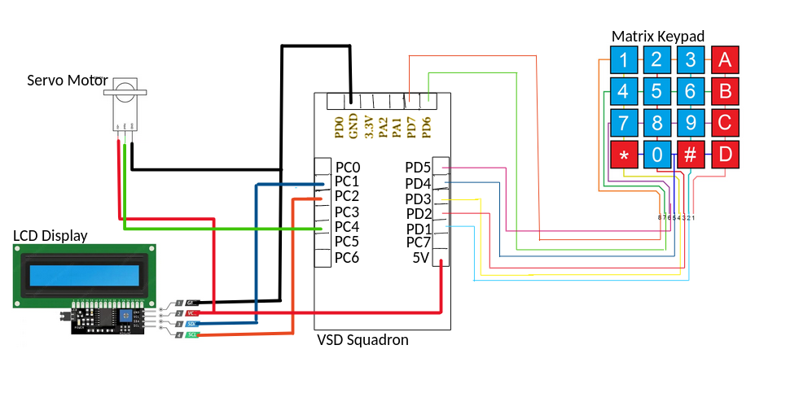

# Secure Saiyan

## Introduction

Introducing Secure Saiyan, our digital lock system. This innovative security solution allows users to input their unique passcode via the keypad, which is processed by the VSD Squadron Mini to verify entry authorization. Upon correct code entry, the VSD Squadron Mini activates the servo motor, rotating the door handle to unlock the door. This system ensures not only security but also offers ease of use, making it suitable for various settings.

## Overview

The Secure Saiyan provides a modern, secure method of entry, integrating technology to improve traditional locking mechanisms. The primary components include a 4x4 matrix keypad for user input, a VSD Squadron Mini for processing and verification, a servo motor to operate the door handle and an LCD screen to display the Status. When a user enters their passcode on the keypad, the VSD Squadron Mini validates the code against stored authorized code. If the passcode is correct, the VSD Squadron Mini triggers the servo motor to rotate the door handle, while the LCD displays UNLOCKED, thereby unlocking the door, else the LCD displays LOCKED, with the servo motor untriggered. This combination of electronic and mechanical elements ensures reliability and user-friendliness.

## Components required
- VSD Squadron Mini
- 4x4 Matrix Keypad
- Servo Motor
- LCD Display
- Breadboard
- Jumper Wires

## Circuit Diagram



## Pin Connections

### Matrix Keypad Connections
- Wire 8 -> PD7
- Wire 7 -> PD6
- Wire 6 -> PD5
- Wire 5 -> PD4
- Wire 4 -> PD3
- Wire 3 -> PD2
- Wire 2 -> PD1

### LCD Display with I2C Interface Connections:
- GND (1) -> VSD Squadron Mini GND
- VCC (2) -> VSD Squadron Mini 5V
- SDA (3) -> PC1 (SDA Pin)
- SCL (4) -> PC2 (SCL Pin)

### Servo Motor Connections:
- Servo 5V -> VSD Squadron Mini 5V
- Servo GND -> VSD Squadron Mini GND
- Servo Input -> PC4

## Working Code for the Project

```C++
#include <debug.h>
#include <ch32v00x.h>
#include <ch32v00x_gpio.h>

// Defining the SDA and SCL Pins for I2C Communication
#define SDA_PIN GPIO_Pin_1
#define SCL_PIN GPIO_Pin_2

// Defining the LCD_Address 
#define LCD_Address 0x27

void lcd_send_cmd(unsigned char cmd);
void lcd_send_data(unsigned char data);
void lcd_send_str(unsigned char *str);
void lcd_init(void);
void delay_ms(unsigned int ms);

// Defining the Keypad Pins
#define R1 GPIO_Pin_0
#define R2 GPIO_Pin_7
#define R3 GPIO_Pin_2
#define R4 GPIO_Pin_3
#define C1 GPIO_Pin_4
#define C2 GPIO_Pin_5
#define C3 GPIO_Pin_6
#define C4 GPIO_Pin_7

// Initializing the servo pin
#define servo GPIO_Pin_4


char Data = '\0'; // This varibale essentially stores each charecter
char password[16] = ""; // Array to store the password (15 chars max + null terminator)
char correctpassword[16] = "2004\0"; // Array to store the correct password
int pos = 0; // Position index for password
unsigned char LockedMessage[16] = "Locked...\0";

// Function to produce a delay
void delay_ms(unsigned int ms) {
    for (unsigned int i = 0; i < ms; i++) {
        for (unsigned int j = 0; j < 8000; j++) {
            __NOP();
        }
    }
}


// Function to compare the passwords
int compareStrings(char str1[], char str2[]) {
    int i = 0;

    while (str1[i] != '\0' && str2[i] != '\0') {
        if (str1[i] != str2[i]) {
            return 0;
        }
        i++;
    }

    if(str1[i] != '\0' || str2[i] != '\0')
    {
        return 0;
    }
    else
    {
        return 1;
    }
}


// Function to clear the password array using a for loop
void clear_password(char pwd[], int length) {
    for (int i = 0; i < length; i++) {
        pwd[i] = '\0'; // Set each element to null character
    }
}

// Function to initialize GPIO pins
void GPIO_INIT(void) {
    GPIO_InitTypeDef GPIO_InitStructure;
    RCC_APB2PeriphClockCmd(RCC_APB2Periph_GPIOD | RCC_APB2Periph_GPIOC, ENABLE);

    // Initialize rows (output pins)
    GPIO_InitStructure.GPIO_Pin = R1 | R3 | R4 | C1 | C2 | C3 | C4;
    GPIO_Init(GPIOD, &GPIO_InitStructure);

    // Using PC4 for row 2
    GPIO_InitStructure.GPIO_Pin = R2;
    GPIO_Init(GPIOC, &GPIO_InitStructure);

    // // Initialize columns (input pins)
    // GPIO_InitStructure.GPIO_Pin = C1 | C2 | C3 | C4;
    // GPIO_InitStructure.GPIO_Mode = GPIO_Mode_IN_FLOATING;
    // GPIO_Init(GPIOD, &GPIO_InitStructure);

    // Initialize SDA and SCL pins for I2C
    GPIO_InitStructure.GPIO_Pin = SDA_PIN | SCL_PIN;
    GPIO_InitStructure.GPIO_Mode = GPIO_Mode_Out_OD;
    GPIO_InitStructure.GPIO_Speed = GPIO_Speed_50MHz;
    GPIO_Init(GPIOC, &GPIO_InitStructure);

    // Initialize Servo Pin
    GPIO_InitStructure.GPIO_Pin = servo;
    GPIO_InitStructure.GPIO_Mode = GPIO_Mode_Out_PP;
    GPIO_InitStructure.GPIO_Speed = GPIO_Speed_50MHz;
    GPIO_Init(GPIOC, &GPIO_InitStructure);
}

// Function to write a byte of data to the I2C bus
void i2c_write(unsigned char dat) {
    for (unsigned char i = 0; i < 8; i++) {
        GPIO_WriteBit(GPIOC, SCL_PIN, Bit_RESET);
        if (dat & (0x80 >> i)) {
            GPIO_WriteBit(GPIOC, SDA_PIN, Bit_SET);
        } else {
            GPIO_WriteBit(GPIOC, SDA_PIN, Bit_RESET);
        }
        GPIO_WriteBit(GPIOC, SCL_PIN, Bit_SET);
    }
    GPIO_WriteBit(GPIOC, SCL_PIN, Bit_RESET);
}

// Function to start I2C communication
void i2c_start(void) {
    GPIO_WriteBit(GPIOC, SCL_PIN, Bit_SET);
    GPIO_WriteBit(GPIOC, SDA_PIN, Bit_SET);
    delay_ms(1);
    GPIO_WriteBit(GPIOC, SDA_PIN, Bit_RESET);
    delay_ms(1);
    GPIO_WriteBit(GPIOC, SCL_PIN, Bit_RESET);
}

// Function to stop I2C communication
void i2c_stop(void) {
    GPIO_WriteBit(GPIOC, SDA_PIN, Bit_RESET);
    GPIO_WriteBit(GPIOC, SCL_PIN, Bit_RESET);
    delay_ms(1);
    GPIO_WriteBit(GPIOC, SCL_PIN, Bit_SET);
    delay_ms(1);
    GPIO_WriteBit(GPIOC, SDA_PIN, Bit_SET);
}

// Function to wait for an acknowledgment bit
void i2c_ACK(void) {
    GPIO_WriteBit(GPIOC, SCL_PIN, Bit_RESET);
    GPIO_WriteBit(GPIOC, SDA_PIN, Bit_SET);
    GPIO_WriteBit(GPIOC, SCL_PIN, Bit_SET);
    while(GPIO_ReadInputDataBit(GPIOC, SDA_PIN));
    GPIO_WriteBit(GPIOC, SCL_PIN, Bit_RESET);
}

// Function to send a command to the LCD
void lcd_send_cmd(unsigned char cmd) {
    unsigned char cmd_l = (cmd << 4) & 0xf0;
    unsigned char cmd_u = cmd & 0xf0;

    i2c_start();
    i2c_write(LCD_Address << 1);
    i2c_ACK();
    i2c_write(cmd_u | 0x0C);
    i2c_ACK();
    i2c_write(cmd_u | 0x08);
    i2c_ACK();
    delay_ms(1);
    i2c_write(cmd_l | 0x0C);
    i2c_ACK();
    i2c_write(cmd_l | 0x08);
    i2c_ACK();
    delay_ms(1);
    i2c_stop();
}

// Function to send data to the LCD
void lcd_send_data(unsigned char data) {
    unsigned char data_l = (data << 4) & 0xf0;
    unsigned char data_u = data & 0xf0;

    i2c_start();
    i2c_write(LCD_Address << 1);
    i2c_ACK();
    i2c_write(data_u | 0x0D);
    i2c_ACK();
    i2c_write(data_u | 0x09);
    i2c_ACK();
    delay_ms(1);
    i2c_write(data_l | 0x0D);
    i2c_ACK();
    i2c_write(data_l | 0x09);
    i2c_ACK();
    delay_ms(1);
    i2c_stop();
}

// Function to send a string to the LCD
void lcd_send_str(unsigned char *str) {
    while (*str) {
        lcd_send_data(*str++);
    }
}

// Function to initialize the LCD
void lcd_init(void) {
    lcd_send_cmd(0x02); // Return home
    lcd_send_cmd(0x28); // 4-bit mode, 2 lines, 5x7 dots
    lcd_send_cmd(0x0C); // Display On, cursor off
    lcd_send_cmd(0x06); // Increment cursor (shift cursor to right)
    lcd_send_cmd(0x01); // Clear display
    delay_ms(20); // Wait for the LCD to process the clear command
}

// Function to set pin mode dynamically
void set_pin_mode(GPIO_TypeDef* GPIOx, uint16_t GPIO_Pin, GPIOMode_TypeDef GPIO_Mode) {
    GPIO_InitTypeDef GPIO_InitStructure;
    GPIO_InitStructure.GPIO_Pin = GPIO_Pin;
    GPIO_InitStructure.GPIO_Mode = GPIO_Mode;
    GPIO_InitStructure.GPIO_Speed = GPIO_Speed_50MHz;
    GPIO_Init(GPIOx, &GPIO_InitStructure);
}

// Functions to find the row for each column
void row_finder1(void) {
    set_pin_mode(GPIOD, C1 | C2 | C3 | C4, GPIO_Mode_Out_PP);
    set_pin_mode(GPIOD, R1 | R3 | R4, GPIO_Mode_Out_PP);
    set_pin_mode(GPIOC, R2, GPIO_Mode_Out_PP);
    // delay_ms(20);
    GPIO_SetBits(GPIOD, R1 | R3 | R4);
    GPIO_SetBits(GPIOC, R2);
    GPIO_ResetBits(GPIOD, C1 | C2 | C3 | C4);
    set_pin_mode(GPIOD, R1 | R3 | R4, GPIO_Mode_IN_FLOATING);
    set_pin_mode(GPIOC, R2, GPIO_Mode_IN_FLOATING);
    // delay_ms(20);
    

    if (GPIO_ReadInputDataBit(GPIOD, R1) == Bit_RESET)
    {
        Data = '1';
        lcd_send_data('1');
        delay_ms(2);
        return;
    }
    if (GPIO_ReadInputDataBit(GPIOC, R2) == Bit_RESET)
    {
        Data = '4';
        lcd_send_data('4');
        delay_ms(2);
        return;
    }
    if (GPIO_ReadInputDataBit(GPIOD, R3) == Bit_RESET)
    {
        Data = '7';
        lcd_send_data('7');
        delay_ms(2);
        return;
    }
    if (GPIO_ReadInputDataBit(GPIOD, R4) == Bit_RESET)
    {
        Data = '*';
        delay_ms(2);
        int result = compareStrings(password, correctpassword);
        if (result == 1)
        {
            unsigned char UnlockedMessage[16] = "Unlocked...\0";
            lcd_send_cmd(0x01); // clear display
            lcd_send_cmd(0x80); // Move the cursor to fist row first column
            lcd_send_str(UnlockedMessage);

            // Now we rotate the servo
            for(int i = 0 ; i < 100 ; i ++)
            {
                GPIO_WriteBit(GPIOC, servo, Bit_SET);
                delay_ms(2.2); // 21 implies 180 degree rotation
                GPIO_WriteBit(GPIOC, servo, Bit_RESET);
                delay_ms(0.1);
            }

            // return 0;
        }

        else
        {
            lcd_send_cmd(0x01); // clear display
            unsigned char Message[16] = "Wrong Password\0";
            clear_password(password, 16);
            pos = 0;
            lcd_send_str(Message);
            delay_ms(2000);
            lcd_send_cmd(0x01); // clear display
            lcd_send_cmd(0x80); // Move the cursor to fist row first column
            lcd_send_str(LockedMessage);
            delay_ms(2000);
            lcd_send_cmd(0xC0); // Move the cursor to second row first column
        }

        return;
    }
}

void row_finder2(void) {
    set_pin_mode(GPIOD, C1 | C2 | C3 | C4, GPIO_Mode_Out_PP);
    set_pin_mode(GPIOD, R1 | R3 | R4, GPIO_Mode_Out_PP);
    set_pin_mode(GPIOC, R2, GPIO_Mode_Out_PP);
    // delay_ms(20);
    GPIO_SetBits(GPIOD, R1 | R3 | R4);
    GPIO_SetBits(GPIOC, R2);
    GPIO_ResetBits(GPIOD, C1 | C2 | C3 | C4);
    set_pin_mode(GPIOD, R1 | R3 | R4, GPIO_Mode_IN_FLOATING);
    set_pin_mode(GPIOC, R2, GPIO_Mode_IN_FLOATING);
    // delay_ms(20);

    if (GPIO_ReadInputDataBit(GPIOD, R1) == Bit_RESET)
    {
        Data = '2';
        lcd_send_data('2');
        delay_ms(2);
        return;
    }
    if (GPIO_ReadInputDataBit(GPIOC, R2) == Bit_RESET) 
    {
        Data = '5';
        lcd_send_data('5');
        delay_ms(2);
        return;
    }
    if (GPIO_ReadInputDataBit(GPIOD, R3) == Bit_RESET)
    {
        Data = '8';
        lcd_send_data('8');
        delay_ms(2);
        return;
    } 
    if (GPIO_ReadInputDataBit(GPIOD, R4) == Bit_RESET)
    {
        Data = '0';
        lcd_send_data('0');
        delay_ms(2);
        return;
    }
}

void row_finder3(void) {
    set_pin_mode(GPIOD, C1 | C2 | C3 | C4, GPIO_Mode_Out_PP);
    set_pin_mode(GPIOD, R1 | R3 | R4, GPIO_Mode_Out_PP);
    set_pin_mode(GPIOC, R2, GPIO_Mode_Out_PP);
    // delay_ms(20);
    GPIO_SetBits(GPIOD, R1 | R3 | R4);
    GPIO_SetBits(GPIOC, R2);
    GPIO_ResetBits(GPIOD, C1 | C2 | C3 | C4);
    set_pin_mode(GPIOD, R1 | R3 | R4, GPIO_Mode_IN_FLOATING);
    set_pin_mode(GPIOC, R2, GPIO_Mode_IN_FLOATING);
    // delay_ms(20);

    if (GPIO_ReadInputDataBit(GPIOD, R1) == Bit_RESET)
    {
        Data = '3';
        lcd_send_data('3');
        delay_ms(2);
        return;
    }
    if (GPIO_ReadInputDataBit(GPIOC, R2) == Bit_RESET)
    {
        Data = '6';
        lcd_send_data('6');
        delay_ms(2);
        return;
    }
    if (GPIO_ReadInputDataBit(GPIOD, R3) == Bit_RESET)
    {
        Data = '9';
        lcd_send_data('9');
        delay_ms(2);
        return;
    }
    if (GPIO_ReadInputDataBit(GPIOD, R4) == Bit_RESET)
    {
        Data = '#';
        lcd_send_data('#');
        delay_ms(2);
        return;
    }
}

void row_finder4(void) {
    set_pin_mode(GPIOD, C1 | C2 | C3 | C4, GPIO_Mode_Out_PP);
    set_pin_mode(GPIOD, R1 | R3 | R4, GPIO_Mode_Out_PP);
    set_pin_mode(GPIOC, R2, GPIO_Mode_Out_PP);
    // delay_ms(20);
    GPIO_SetBits(GPIOD, R1 | R3 | R4);
    GPIO_SetBits(GPIOC, R2);
    GPIO_ResetBits(GPIOD, C1 | C2 | C3 | C4);
    set_pin_mode(GPIOD, R1 | R3 | R4, GPIO_Mode_IN_FLOATING);
    set_pin_mode(GPIOC, R2, GPIO_Mode_IN_FLOATING);
    // delay_ms(20);

    if (GPIO_ReadInputDataBit(GPIOD, R1) == Bit_RESET)
        lcd_send_data('A');
    if (GPIO_ReadInputDataBit(GPIOC, R2) == Bit_RESET)
        lcd_send_data('B');
    if (GPIO_ReadInputDataBit(GPIOD, R3) == Bit_RESET)
        lcd_send_data('C');
    if (GPIO_ReadInputDataBit(GPIOD, R4) == Bit_RESET)
        lcd_send_data('D');
}

int main(void) {
    GPIO_INIT(); // Initialize the GPIO pins
    delay_ms(20);

     // Initialize the Servo Motor
    for(int i = 0 ; i < 100 ; i ++)
    {
        GPIO_WriteBit(GPIOC, servo, Bit_SET);
        delay_ms(1); // 7 implies 0 degree rotation
        GPIO_WriteBit(GPIOC, servo, Bit_RESET);
        delay_ms(0.019);
    }

    
    // Initialize the LCD Display
    lcd_init();
    delay_ms(20);
    lcd_send_cmd(0x80); // Move the cursor to first row first column
    delay_ms(20);
    unsigned char WelcomeMessage[16] = "Secure Sayan\0";
    lcd_send_str(WelcomeMessage);
    delay_ms(2000);

    lcd_send_cmd(0x01); // clear display
    delay_ms(20);
    lcd_send_cmd(0x80); // Move the cursor to first row first column
    delay_ms(20);
    lcd_send_str(LockedMessage);
    delay_ms(2000);

    

    lcd_send_cmd(0xC0); // Move the cursor to second row first column
    delay_ms(20);


    while (1) 
    {
        set_pin_mode(GPIOD, C1 | C2 | C3 | C4, GPIO_Mode_Out_PP);
        set_pin_mode(GPIOD, R1 | R3 | R4, GPIO_Mode_Out_PP);
        set_pin_mode(GPIOC, R2, GPIO_Mode_Out_PP);
        // delay_ms(20);
        GPIO_SetBits(GPIOD, C1 | C2 | C3 | C4);
        // delay_ms(20);
        GPIO_ResetBits(GPIOD, R1 | R3 | R4);
        GPIO_ResetBits(GPIOC, R2);
        // delay_ms(20);
        set_pin_mode(GPIOD, C1 | C2 | C3 | C4, GPIO_Mode_IN_FLOATING);

        if (GPIO_ReadInputDataBit(GPIOD, C1) == Bit_RESET)
            row_finder1();
        else if (GPIO_ReadInputDataBit(GPIOD, C2) == Bit_RESET)
            row_finder2();
        else if (GPIO_ReadInputDataBit(GPIOD, C3) == Bit_RESET)
            row_finder3();
        else if (GPIO_ReadInputDataBit(GPIOD, C4) == Bit_RESET)
            row_finder4();
        delay_ms(500);

        if (Data != '*' && Data != '\0')
        {
            password[pos] = Data;
            pos = pos + 1;
            password[pos] = '\0';
            Data = '\0';
        }
    }
}
```

